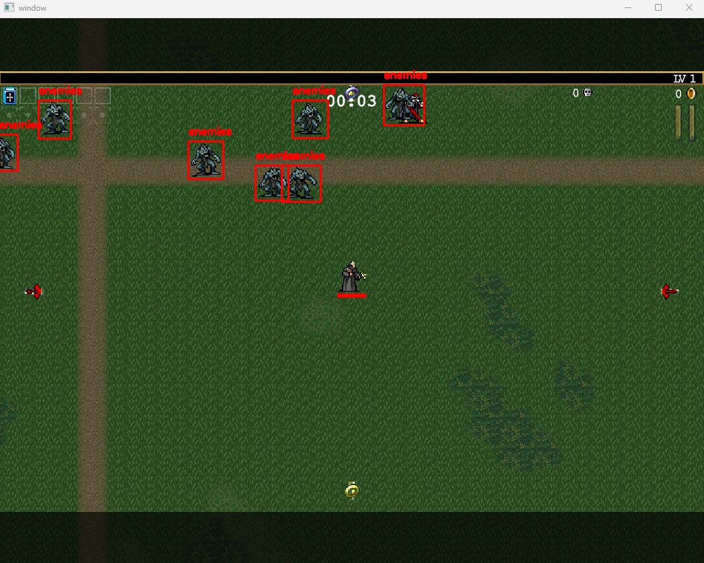
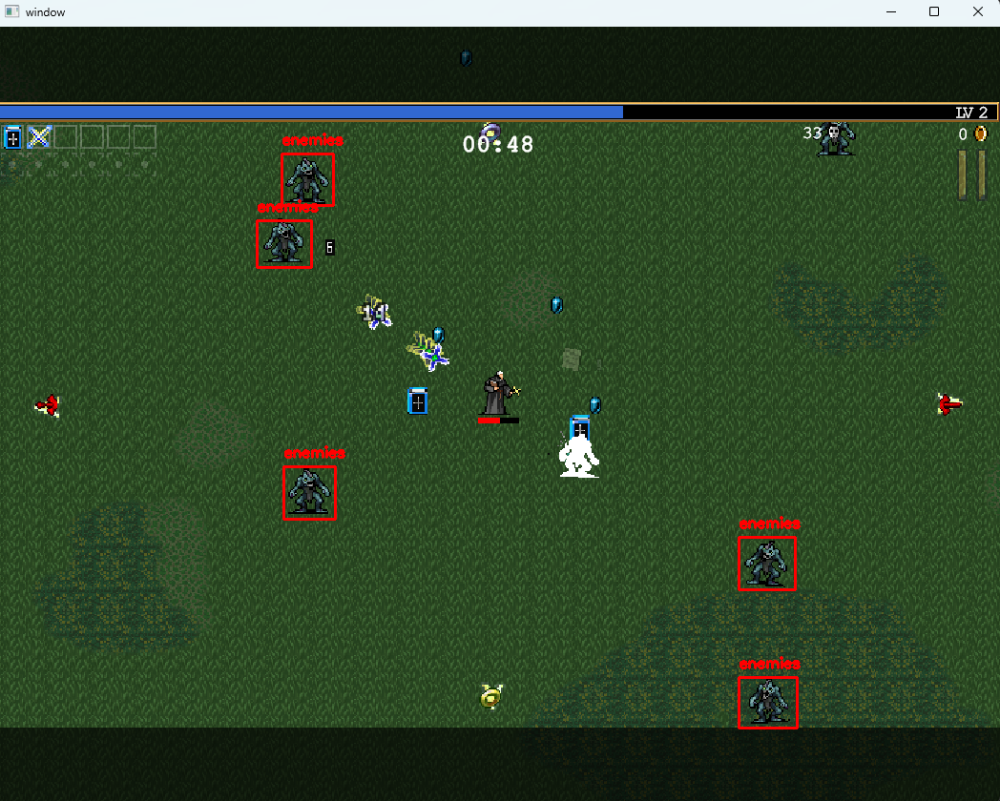

This repository serves as a personal learning resource for understanding YOLOv4-tiny and training custom object detection models. In this repository you will find a step-by-step guide detailing a small project I undertook to implement real-time object detection. The project focuses on detecting enemies in the game "Vampire Survivors" and provides insights into the process of training and utilizing a YOLOv4-tiny model for this purpose. By following the outlined steps, you can gain practical knowledge on how to utilize image capture, train your own object detection models, and potentially applying them to real-world scenarios.
Note: Some explanations might seem lengthy, due to me cherry-picking concepts I am not familiar with, possibly leading to going off on a tangent/down the rabbit hole. Please be advised.







# Learning object detection using Yolo, OpenCV and other relevant dependencies
- Before jumping into "real-time" object detection, I first learned how to recognize a simple object in an image. First we need to think about breaking the problem into smaller pieces, and ask ourselves, how do we start interacting with the picture? How do we specify the "thing" we want to find in the picture? And lastly how do we match what we find? 
This was done in the repository (image_recognition)

Summary of how it works:

Image recognition in this script works by using template matching, which is a technique that searches for a smaller image (needle) within a larger image (haystack). The cv.matchTemplate() function slides the needle image over the haystack image and calculates the correlation coefficient at each position. The regions with high correlation coefficients are considered potential matches.

The script then applies thresholding to filter out the regions with low confidence scores and keeps only the regions that are likely to contain the needle image. The detected regions are represented as rectangles, and the script groups overlapping rectangles to reduce redundant detections.

Finally, the center points of the detected rectangles are calculated and returned as the result of the image recognition process. These points indicate the locations where the needle image is found within the haystack image.

Step by step process:

To start off, we first "load the images". This can be done via a "needle" and "haystack" metaphor. We make a script that starts by "loading" the haystack image (whole picture), and the needle image (cropped image within the whole picture that we want to pinpoint) using cv.imread() function from the OpenCV library. 
We then have to do "template matching". This is done via cv.matchTemplate() function to find the best matching regions of the needle image within the haystack image.
There are several parameters (the one I've picked is set to cv.TM_CCOEFF_NORMED), which is a normalized correlation coefficient at each position. Higher values indicate a better match.
The result of cv.matchTemplate() is a matrix of confidence scores, where each value represents how well the needle image matches the corresponding region in the haystack image.
After template matching, we need to perform "Thresholding". We create a script that applies a value (i.e. threshold=0.80) to the result matrix using np.where() to find the locations where confidence score >= to the threshold. In other words, the locations where it's higher or equal to the threshold is what we want. This step filters out the regions with low confidence scores and keeps only the regions that are likely to contain the needle image.
After thresholding, we "process the location" that was returned to us. The locations returned by np.where() are in a format of (y, x) coordinates, since that's super confusing, we convert it to (x, y) tuples using zip() and list().
Lastly, we "Group the rectangles". We create a script that creates a list of rectangles based on the locations and the dimensions of the needle image. Each rectangle represents a potential match of the needle image within the haystack image. The cv.groupRectangles() function is used to group overlapping rectangles and reduce redundant detections.


Now that we have learned how to interact/pick and choose images we can now go ahead and implement our findings to a continous, real-time image. But first, same as before we need to break down the problems into smaller steps. Questions such as "how do we capture real time images?", "How do we constantly check for the match and process these real time images?", "Is processing the image different in real time?" need to be solved before we jump into the machine learning/data set portion. 
To start off, we need to work on our script for "Capturing the screenshots". As this step suggests, it will be responsible for capturing screenshots of a specific window or the entire screen. But in our __init__ method, we specify the window name to capture (if no window name is provided, it will capture the entire screen). Next, the get_screenshot method captures the screenshot of the specified window/screen and returns it as a NumPy array. Since we also need to specify the window size, we can create a get_window_size() method. Lastly, the get_screen_position() method translates a pixel position on the screenshot image to the corresponding pixel position on the screen. 
I'd like to take a step back here and expand on the get_screenshot() method. There is quite a lot to cover in this method due to very specific configurations such as compatibility, as well as freeing resources, I would like to share my findings. When "taking screenshots" of certain application windows, there seems to be the following codes that appear over and over again: 

```
hwnd_dc = win32gui.GetWindowDC(hwnd) 
- To put simply, first we retrieve the device context (DC) for the window using win32gui.GetWindowDC(). The Device Context represents the drawing surface of the window and is necesssary for capturing the window's context. This also provides a way to interact with the window's graphics and obtain information about its properties. 
Next we create an MFC (Microsoft Foundation Class) device context from the window's device context using win32ui.CreateDCFromHandle(). 

mfc_dc = win32ui.CreateDCFromHandle(hwnd_dc)
- Next we create an MFC (Microsoft Foundation Class) device context from the window's device context using win32ui.CreateDCFromHandle(). The MFC device context is a higher-level abstraction built on top of the raw device context obtained from the window. This provides additional functionality and compatibility with the MFC framework, which is used by the win32ui module. Creating an MFC device context allows us to utilize the features and methods provided by the win32ui module for capturing the window image

save_dc = mfc_dc.CreateCompatibleDC()
- This step creates a memory-based device context that is compatible with the MFC device context. The memory-based device cont4ext is used as a temporary drawing surface to capture the window image. It allows us to create a bitmap object and select it into the memory-based device context for drawing operations. By using memory-based-device context, we can capture the window image without directly modifying the window's actual device context.

bitmap = win32ui.CreateBitmap()
- This step creates a bitmap object using the win32ui module. This object represents an image that we can draw onto and manipulate. Serves as the destination for capturing the window image.

bitmap.CreateCompatibleBitmap(mfc_dc, w, h)
- This step creates a bitmap that is compatible with the MFC device context and has the same dimensions as the window's client area. It ensures that the bitmap has the correct size to capture the entire window image. Tthe bitmap is associated with the MFC device context, which is necessary for the subsequent drawing operations (rectangle)

save_dc.SelectObject(bitmap)
- This step selects the bitmap object into the memory-based device context. By selecting the bitmap, we are specifying that any subsequent drawing operations will be performed on the bitmap rather than the actual window. In other words, this allows us to capture the window image by drawing it onto the selected bitmap using the memory-based device context.
```

The combination of these steps is necessary to set up the required device contexts and bitmap objects for capturing the window screenshot. Here's a summary of the process:

We retrieve the window's device context to access its drawing surface.
We create an MFC device context from the window's device context to utilize the functionality provided by the win32ui module.
We create a memory-based device context compatible with the MFC device context to serve as a temporary drawing surface.
We create a bitmap object to store the captured window image.
We create a compatible bitmap with the same dimensions as the window's client area and associate it with the MFC device context.
We select the bitmap into the memory-based device context, so that the window image can be drawn onto the bitmap.

Now that everything is prepared for the capturing of the window screenshot, the main code that captures this is the following:

```
(https://github.com/BoboTiG/python-mss/issues/180)
*NOTE if you need high performance capture (>=60fps) then make sure you aren't opening/closing the handles everytime .
result = windll.user32.PrintWindow(hwnd, save_dc.GetSafeHdc(), 3)
- This Captures the window image using the PrintWindow() function from the user32.dll library. It takes the window handle, the memory-based device context, and a flag value of 3 (indicating the capture method) (1 = Captures only the client area of the window, excluding the window frame, title bar, and scrollbars., 2 = Renders the full content of the window, including any parts that are currently not visible due to scrolling. 3 = (bitwise OR operation)). The captured image is drawn onto the selected bitmap in the memory-based device context. Specifically designed to capture windows with hardware acceleration enabled.
```

After capturing the image, we then retrieve information about the bitmap, such as its dimensions, using bitmap.GetInfo().
bitmap.GetBitmapBits(True) retrieves the bitmap data as a byte string and the (true) parameter indicates that the bitmap data should be retrieved in a top-down order. Image.frombuffer(...) creates a PIL (python imaging library) image object from the bitmap data. The parameter specify the color mode ("RGB"), dimensions (obtained from bmpGetInfo), bitmap data (bmpstr), and other format-specific details.

```
bmpinfo = bitmap.GetInfo()
bmpstr = bitmap.GetBitmapBits(True)
im = Image.frombuffer(
    "RGB", (bmpinfo["bmWidth"], bmpinfo["bmHeight"]), bmpstr, "raw", "BGRX", 0, 1)
```

The next block of code checks if the result of the PrintWindow() is not equal to 1, indicating a failure in capturing the window image. If the condition is true, it performs cleanup by deleting the bitmap object, deleting the memory-based device context, deleting the MFC device context, and releasing the window's device context.
Next it then raises a RuntimeError with an error message indicating the failure and the result value.

```
if result != 1:
    win32gui.DeleteObject(bitmap.GetHandle())
    save_dc.DeleteDC()
    mfc_dc.DeleteDC()
    win32gui.ReleaseDC(hwnd, hwnd_dc)
    raise RuntimeError(
        f"Unable to acquire screenshot! Result: {result}")
```

The next line img = np.array(im)[:, :, ::-1].copy() converts the PIL image object to a NumPy array, reverses the order of the color channels in the NumPy array. This is done to convert the color format from BGR (used by the bitmap) to RGB. Then .copy() creates a copy of the NumPy array to ensure it is contiguous is memory. 
Then, we free up resources by deleting the bitmap object, memory-based device context, MFC device context, and window's device context. 

Next, img = np.ascontiguousarray(img) ensures that the NumPy array is contiguous in memory to avoid potential errors in subsequent operations that require continguous arrays.
* A contiguous array is an array whose elements are stored in a contiguous block of memory, meaning that the elements are stored sequentially without any gaps/strides between them. In other words, the memory layout of a continguous array is such that the elements are laid out in a single, continuous block of memory. 
* In Numpy, there are two types: C-contiguous (default)(row-major order) (np.ascontiguousarray(img)) , and F-contiguous (column-major order)( np.asfortranarray(img)).

Lastly, the method returns the captured window image as a NumPy array.


Now that we have understood/successfully captured the window image (as a NumPy array), we now have to process that array. To do so, let's look at the imageprocessor.py
This function takes three parameters: 
```
img_size: Represents the size of the input image that will be processed by the YOLOv4-tiny model. Expected to be a tuple or list containing the width and height of the image (416, 416). the img_size is used to set the self.W and self.H attributes of the ImageProcessor instance, which store the width and height of the image, respectively.

cfg_file: This parameter represents the path to the configuration file of the YOLOv4-tiny model. The configuration file contains the architecture and hyperparameters of the model. Typically a .cfg file that defines the layers, connections and settings of the neural network. Typically cfg_file is used along with the weights_file to load the pre-trained YOLOv4-tiny model using the cv.dnn.readNetFromDarknet() function from the OpenCV library. 

weights_file: This parameter represents the path to the weights file of the YOLOv4-tiny model. This file contains the learned parameters of the pre-trained model. Typicaly a .weights file that holds the trained weights of the neural network.
```

Now digging deeper into the code, we will see how the ImageProcessor class is initiated.
1. Setting a random seed. In machine learning and computer vision tasks, randomness is often involved in various operations, such as weight initialization, data shuffling, or augmentations. By setting a random seed, you ensure that the random operations generate the same sequence of random numbers every time the code is run, making the results reproducible. (i.e. if typed numpy.random.rand(4) and want the same "random" number generated everytime, you have to "np.random.seed()", otherwise the "random" number will be different everytime). Honestly, this line isn't necessary in this specific case, but in the future if the model's weights are randomly initialized, setting a random seed ensures that the same initial weights are used each time the model is trained, leading to reproducible training results. 
2. Load the YOLOv4-tiny model using provided config file(cfg_file) and weights file (weights_file) with cv.dnn.readNetFromDarknet()
3. Set the preferred backend for the model to OpenCV's DNN module using self.net.setPreferableBackend(cv.dnn.DNN_BACKEND_OPENCV). OpenCV's DNN (Deep Neural Network) module supports multiple backends for running deep learning models. The backend determines the computational framework or library used to execute the model. 
Some common backends supported by OpenCV's DNN module include:
OpenCV's default backend: It uses OpenCV's own optimized implementations for running the model.
CUDA backend: It utilizes NVIDIA's CUDA library to run the model on a GPU, which can provide significant speedup for computationally intensive tasks.
OpenCL backend: It uses OpenCL (Open Computing Language) to run the model on various devices, including CPUs, GPUs, and other accelerators.
Intel's Inference Engine backend: It leverages Intel's Inference Engine library for optimized model execution on Intel hardware.

4. Retrieve the names of the output layers from the model and store them in self.ln.
5. Set the image width (self.W) and height (self.H) based on the provided img_size.
6. Read the class names from the obj.names file and store them in the self.classes dictionary.
7. Define a list of colors (self.colors) for drawing bounding boxes around detected objects.


*TO do: 
Finish typing the DNN line 
Figure out what DNN is.
Are there other alternative to use DNN in this case besides the "alternative", why is it 
good in this case.
Spring from DNN and look at other choices
DNN, CNN, Attention, diffusion, etc.


